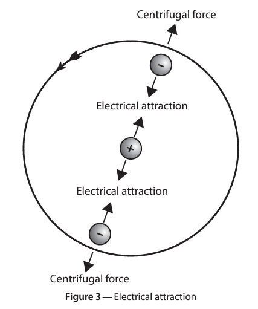

# Fundamentals of Electricity

## Basic Principles

##### **Electricity:**  
- a form of energy resulting from electrons being pushed or pulled out of their valence shell
##### **Matter:** 
- anything that occupies space and has weight.
##### **Atoms:** 
- the basic building blocks of matter composing of a nucleus (neutrons and protons) and layer(s) of electrons.

### Atomic Theory

- An atom consists of a nucleus being orbited by layer(s) of electrons.
- A nucleus consists of a cluster of neutrons and protons.
- Neutrons make up the mass of the atom and have no electric charge (neutral)
- Protons have a positive electric charge.
- Electrons have a negative charge and are in orbit around the nucleus.

**Examples:**

- The Hydrogen atom (left) has one electron orbiting its nucleus. Its nucleus has only one proton to balance the charge.
- The Copper atom (right) has 29 electrons orbiting the nucleus, which in turn has 29 protons to balance the charge.
- Atoms are determined by the number of protons in its nucleus and the way the electrons are arranged in orbit.

##### **Bound Electrons:**
- Electrons in the inner orbits. These require much more energy to move out of orbit.
##### **Free Electrons:**
- Electrons in the valence shell (outer orbit). These can be pushed or pulled out of orbit.
- Movement of valence electrons determines the behaviour of electrical circuits.

##### **"Like Charges Repel and Unlike Charges Attract"**

### **Movement of Valence Electrons:**
- Energy added to electrons in the valence shell is equally distributed among all electrons in that same orbit.
- This means less energy is required to push or pull these valence electrons out of orbit if there are less electrons inside that valence orbit.
- Atoms with less electrons in the valence shell are therefore more conductive elements.

##### **Conductors:**
- Elements with one to three electrons in the valence shell. Their ability to pass current is dependant on:
	1. Material;
	2. Cross-section area;
	3. length; and
	4. temperature

**Material**: Most metals are good conductors, while most non-metals are poor conductors. Silver is the most conductive element, with copper and aluminum being the most commonly used elements for conduvtivity.

**Cross-Section Area:** A larger cross-section area carries more current than a smaller area. This is why we have different guages of wire. A higher guage wire is thinner and carries less current than a lower guage of wire.

**Length:** A longer conductor has a greater resistance to current flow than a shorter one. As a result there are limits to effective length of a conductor for a given guage.

**Tempterature:** Resistance increases with temperature, reducing conductivity. This is helpful in practical applications such as Electric Heat Trace and Remote Temperature Devices.

##### **Insulators:**
- Elements with five to eight electrons in the valence shell.
- Elements can be mixed together with others to create compounds with an even greater resistance to electrical current. Common materials used as insulators are glass, rubber and plastic. 
- Inert gases are examples of elements with five to eight valence electrons.

##### **Semi-Conductors:**
- Elements with exactly four electrons in the valence shell.
- These elements are both poor conductors and poor insulators.
- These elements can be mixed with others to create compounds to fill either role. An example includes germanium and silicon being mixed with elements such as arsenic to create a conductor.